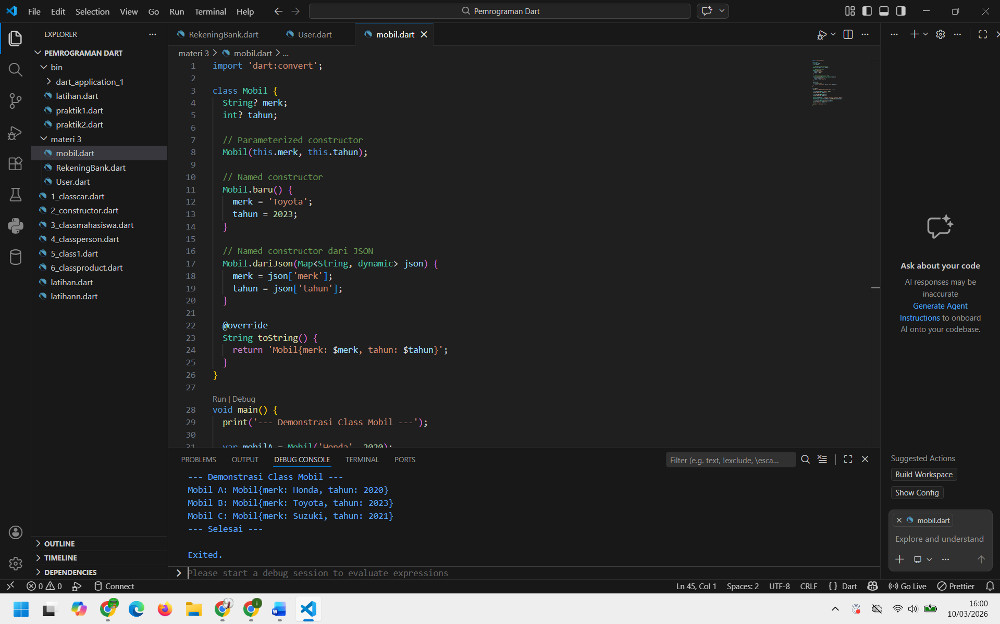
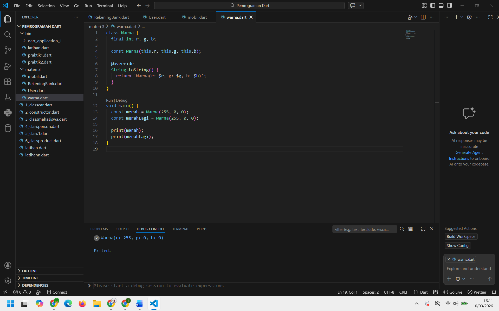
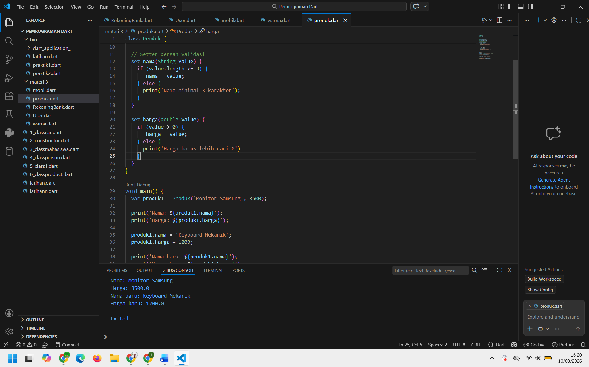
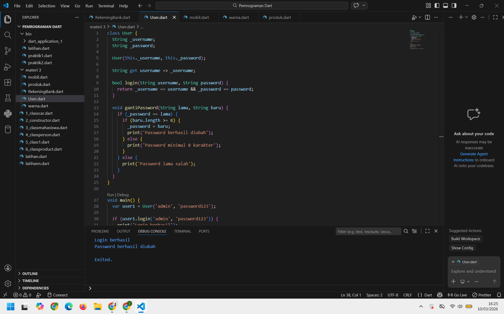
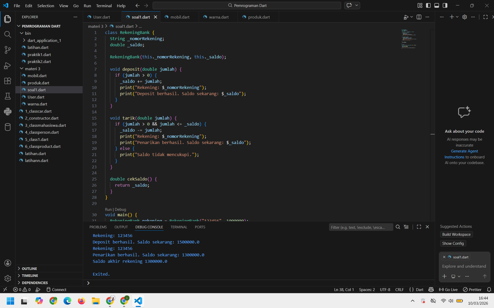
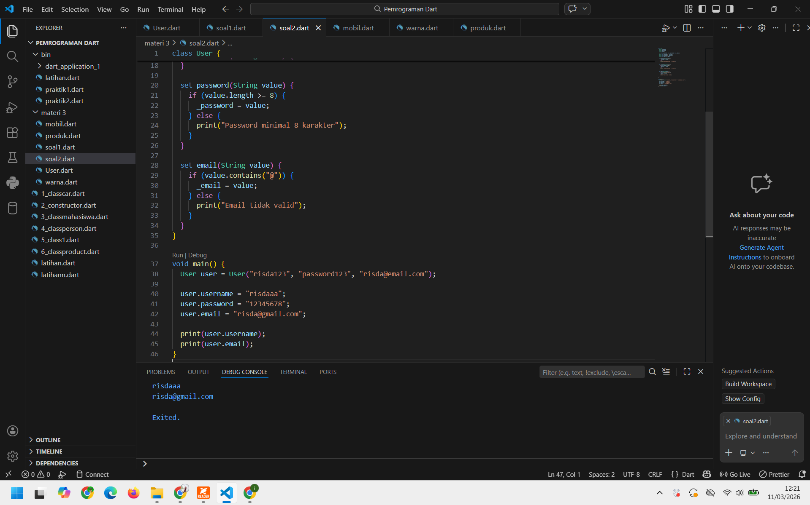

## Nama : Risda Dwi Minarti (23141022P)
## Mk	 : Pemrograman Berorientasi Objek

## Resume Materi OOP Dart – Constructor dan Enkapsulasi

  Pada sesi ini dibahas tentang constructor dan enkapsulasi dalam pemrograman Dart yang merupakan bagian dari konsep Object Oriented Programming (OOP). Constructor adalah method khusus yang digunakan untuk menginisialisasi objek ketika objek dibuat. Dalam Dart terdapat beberapa jenis constructor seperti default constructor, named constructor, parameterized constructor, constant constructor, dan factory constructor. Constructor membantu programmer mengatur nilai awal dari atribut pada sebuah class.
  Selain constructor, materi ini juga membahas tentang enkapsulasi. Enkapsulasi adalah konsep untuk menyembunyikan data dalam sebuah class agar tidak dapat diakses secara langsung dari luar class. Tujuan enkapsulasi adalah untuk menjaga keamanan data, mengontrol akses data, serta memudahkan perubahan sistem di masa depan.
  Dalam Dart, enkapsulasi dilakukan dengan menggunakan underscore (_) untuk membuat field menjadi private. Data yang bersifat private dapat diakses melalui getter dan diubah menggunakan setter. Getter berfungsi untuk membaca nilai data, sedangkan setter digunakan untuk mengubah nilai data dengan kemungkinan adanya validasi.
  Dengan menggunakan constructor dan enkapsulasi, program menjadi lebih terstruktur, aman, dan mudah dikelola, terutama dalam pengembangan aplikasi yang besar.

## Output Program

### Program Mobil

### Program Warna

### Program Mobil

### Program User

### Program Soal 1

### Program Soal 2

